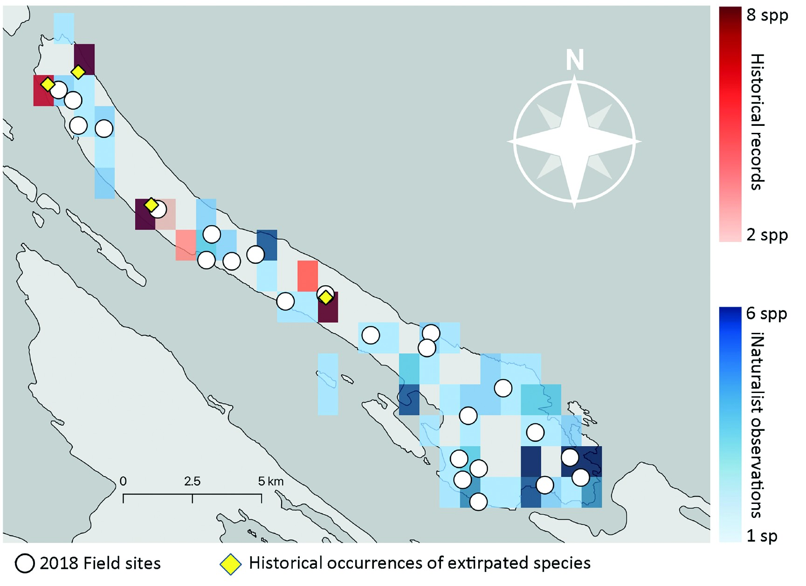
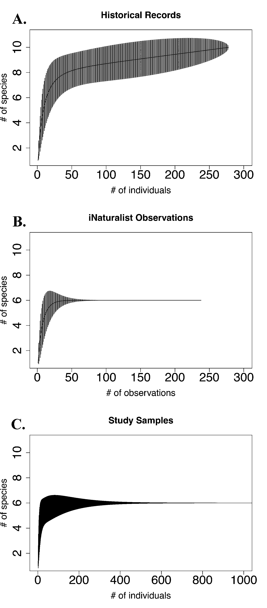

Historical richness (red) against recent iNaturalist richness (blue), with 2018 field sites (white circles) and the historical collection localities of the island's three probably-extirpated species (yellow diamonds). From Simon, Best & Starzomski (2023).

Ten bumble bee species were known historically from Galiano Island, based on 278 specimens collected between 1970 and 2010 and held in two BC museum collections. A [paper](https://doi.org/10.3955/046.096.0305) I published in 2023 with Lincoln Best and Brian Starzomski set out to check how many of those ten are still here—and found that only five have been detected since 2016.

Three species—*Bombus insularis*, *B. occidentalis*, and *B. suckleyi*—haven't turned up since 1990, despite a full season of intensive, targeted trapping and years of community observation. Two more, *B. fervidus* and *B. flavidus*, were only ever singletons in the historical record to begin with, and neither has reappeared either. *Bombus occidentalis* is the notable one: its regional decline has been documented for decades, but this is, as far as we know, the first time its probable local extirpation has been established within a part of its range that's actually been surveyed carefully enough to say so with confidence.

There's a smaller, sadder detail buried in that loss. *Bombus suckleyi* is an obligate cuckoo bumble bee—it doesn't build its own nest or raise its own young, it invades the nests of *B. occidentalis* and lets that colony do the work. It isn't known to parasitize any other species on the island. When its only host disappeared, it had nowhere else to go. The two seem to have vanished together.

Set against that loss, one species arrived. *Bombus vosnesenskii* was first recorded on Galiano in 2017—an iNaturalist photo, since confirmed by trapped specimens—and its spread elsewhere in coastal British Columbia has tracked the same timeline as *B. occidentalis*'s decline, consistent with it moving into a niche left vacant. Elsewhere in the region it's known as an urban generalist, often the dominant bumble bee in cities. On Galiano, still mostly forested, it's the rarest of the six species we found—which either means the island's forest cover is holding a foothold species at bay, or that it simply hasn't finished arriving yet.

Historical records point to 10 species (A); iNaturalist observations (B) and a full season of trapping (C) independently converge on the same 6.

The methodological result is the one I'd point to first. We sampled the current community two ways: an intensive season of blue vane trapping that caught 47,896 bees, and five years of casual, crowd-sourced iNaturalist photos—238 of them. Both converged on exactly the same estimate of present-day richness, and a null model test confirmed the two datasets weren't statistically distinguishable. A free app that anyone on the island could contribute to, with no training and no traps, did the same job as trapping tens of thousands of bees to near-exhaustion.

That comparison matters because blue vane traps are not gentle. Trapping worked here, and the scale of it is exactly why it's hard to justify as a routine method—passively killing tens of thousands of insects, including queens, to answer a question a smartphone could have helped answer instead. Community-contributed data won't work everywhere; it depends on a small, well-known local species pool and a decent historical baseline to compare against, conditions Galiano happened to meet. But where those conditions hold, it's a real alternative to methods that cost the animals being counted.

One more detail didn't make it into the results tables. Rosemary Georgeson, an Indigenous resident of Galiano Island, described once watching an unusually large bumble bee cross open water over the Salish Sea and land on her boat near the mouth of the Fraser River—consistent, in size and season, with the long-distance dispersal of a new queen. Galiano isn't a closed system; islands rarely are, for a species that can fly. It's a reminder that colonization and extirpation are two ends of the same process, playing out over water as much as land.

This work was presented as a poster at the Canadian Society for Ecology and Evolution meeting in 2024, alongside Lincoln Best and Brian Starzomski.
