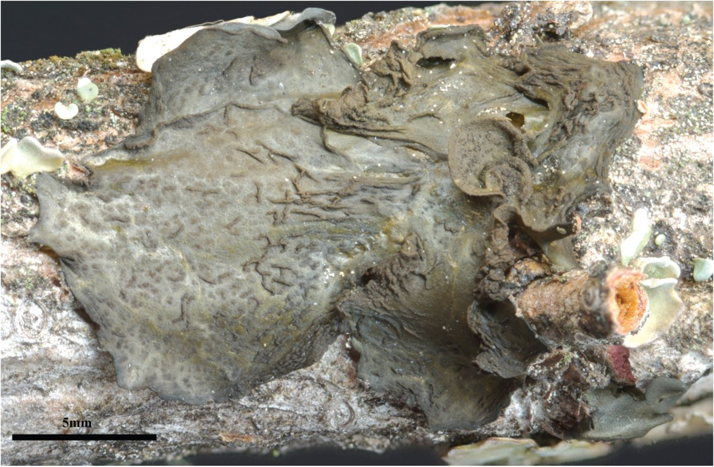
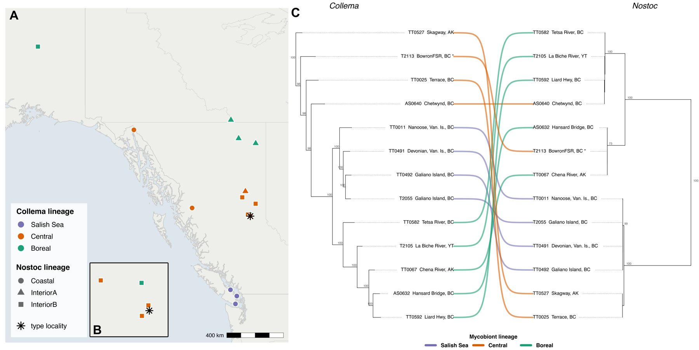

<em>Collema coniophilum</em>, the crumpled tarpaper lichen—a bark-dwelling cyanolichen, shown here as the holotype specimen. Photo: Tim Wheeler.

*Collema coniophilum* is a small, dark, gelatinous lichen—a cyanolichen, partnered with a nitrogen-fixing cyanobacterium (*Nostoc*) rather than a green alga—that grows on bark in humid forests. When it was described in 2009 from the upper Fraser River watershed in British Columbia, it was known from just seven localities and treated as a rare endemic. Since then, its documented range has expanded fourfold, turning up from boreal Yukon and Alaska south to the warm-summer Mediterranean islands of the Salish Sea.

For a threatened species, a wider range sounds like good news. But it raises a harder question: is this one species spreading across an enormous climatic gradient, or several distinct lineages that have been lumped under a single name? For conservation, the distinction matters—it changes what, exactly, you are trying to protect.

The usual way to check would be the fungal DNA barcode, the ITS region. In *Collema coniophilum*, though, it kept failing to amplify—and once we could look at it across whole genomes, the reason became clear: here ITS is both paralogous and uninformative. Each genome carries several divergent copies, most of them degraded pseudogenes with a telltale drift toward high AT content, while the one functional copy is identical in every sample. The standard marker simply can't resolve the structure.

So we turned to the genomes themselves. Working in the [Spribille Lab](https://spribillelab.wordpress.com) at the University of Alberta, we recovered draft genomes for both partners from 19 thalli spanning the expanded range, and applied two independent genome-scale analyses. A phylogenomic tree built from 495 shared single-copy genes, and a separate SNP-based clustering analysis, converge on the same picture: three well-supported, geographically structured fungal lineages—boreal, central, and southern coastal (Salish Sea). A population-structure analysis agrees, with only a hint of admixture between them, so the lineages appear divergent but not completely isolated.

Left: sampling localities across the expanded range, coloured by fungal lineage (Salish Sea, central, boreal). Right: facing phylogenies of the fungus (<em>Collema</em>) and its cyanobacterial partner (<em>Nostoc</em>)—the tangled connecting lines show that the two don't share the same evolutionary map.

There's a further twist in the symbiosis. The fungus and its *Nostoc* partner don't sort the same way: *Collema* resolves into three lineages, but *Nostoc* into one coastal and two interior groups. Read side by side, the two trees are tangled rather than parallel—pointing to photobiont switching, the partners swapping and re-pairing over time, and to the two responding differently to climate, in a lichen that otherwise disperses clonally, both partners together.

So—populations, or cryptic species? By average nucleotide identity, the lineages sit right in the grey zone: within-lineage similarity edges just above between-lineage similarity, which is exactly why the question deserves care rather than a quick answer. This is ongoing conservation-assessment work, alongside COSEWIC and the BC Conservation Data Centre, and where the line is drawn will shape how *Collema coniophilum* is evaluated and protected. It's also a small reminder that the tool we reach for first—a single gene, a familiar marker—quietly shapes what we're able to see.

Preliminary results, presented with Toby Spribille at the International Association for Lichenology symposium. This work is ongoing and not yet peer-reviewed.

