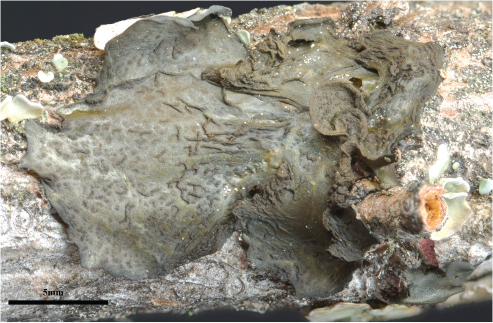
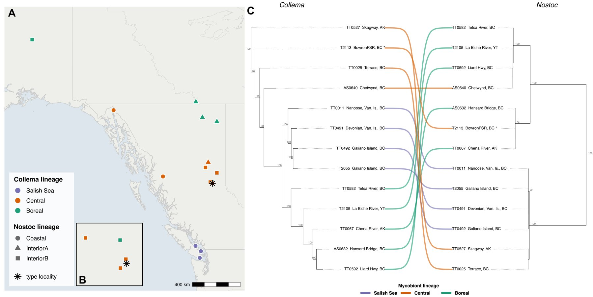

<em>Collema coniophilum</em>, the crumpled tarpaper lichen. Photo: holotype specimen, Tim Wheeler.

*Collema coniophilum*, the "crumpled tarpaper" lichen, was [described in 2009](https://doi.org/10.1639/0007-2745-112.1.109) from the inland rainforests of the upper Fraser River watershed, British Columbia. Known then from seven localities, it was considered a rare endemic, currently assessed as threatened in Canada.

Yet—through additional sampling by Paula Bartemucci, Christopher Lewis, Toby Spribille, and myself—its documented range has since expanded more than fourfold, with new records extending from boreal Yukon and Alaska to the warm-summer Mediterranean islands of the Salish Sea. For a threatened species, this expanded range posed a conservation problem: are we really looking at a single species distributed across such ecologically and geographically disparate regions—or different populations of conservation significance?

Answering that requires genetic evidence, and the usual markers could not provide it: ITS, the standard fungal barcode, repeatedly failed to amplify, and mtSSU—the marker used to support the expanded range—could not resolve variation within the species.

Working in the [Spribille Lab](https://spribillelab.wordpress.com) at the University of Alberta, we took a whole genome approach to solving the problem, sequencing metagenomes from 19 thalli across the lichen's expanded range. Two independent genome-scale analyses converged on the same result: three geographically structured fungal lineages—boreal, central, and southern coastal (Salish Sea)—completely invisible to standard molecular markers!

Sampling localities across the expanded range, coloured by fungal lineage, beside facing phylogenomic trees whose tangled connections reveal discordant histories in the lichen's two symbiotic partners.

The lichen's cyanobacterial partner tells its own story: a twisted subplot in this symbiotic consortium, which we are now working to disentangle.

Preliminary results presented at the 10th Symposium of the International Association for Lichenology. This work is ongoing, with the support of the Committee on the Status of Endangered Wildlife in Canada, the British Columbia Conservation Data Centre, and the BC Parks License Plate Project.

