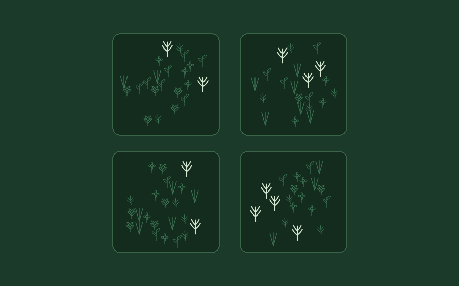
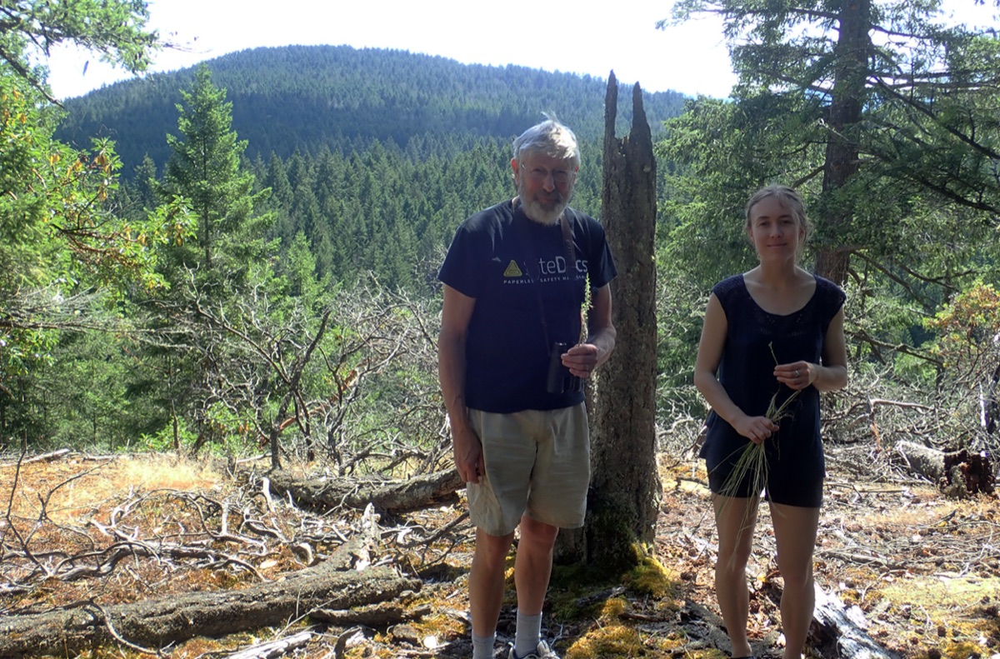

<em>Primula pauciflora</em>, one of two species we inferred as likely extirpated on Galiano Island. Photo: Peter Zika.

The Royal Botanic Gardens, Kew released its sixth [State of the World's Plants and Fungi report](https://www.kew.org/science/state-of-the-worlds-plants-and-fungi) this year, a conservation assessment of plants and fungi drawing on work from over 400 scientists across 40 countries. Its headline finding: AI and mass digitization of herbarium and fungarium specimens—what the report calls a digital revolution—are providing us with unprecedented technological capacity for biodiversity assessment. Kew alone has now digitized all 7.4 million specimens in its own collections, enough to spot species new to science in a smartphone photo or read a century of shifting flowering times out of pressed and dried plants. But cataloguing what exists is a much easier task than determining what may have disappeared.

How many of the world's plants and fungi are threatened with extinction, or have already disappeared? Only a small fraction of their diversity has ever been formally assessed, because absence is almost always uncertain—an inference from negative evidence. [Aelys Humphreys and colleagues](https://doi.org/10.1111/nph.70552) recently gave this gap a name: the *Katuš shortfall*—the unquantified dimensions of past, present, and future biodiversity loss.

To rise to this global challenge, the report underlines the need for probability-based approaches, already common in animal conservation, to estimate whether a species is truly gone or simply undetected. My colleagues and I address this challenge in a recent [paper](https://doi.org/10.1002/ppp3.70130), only rather than tackling extinction *writ large* at the global scale, we address it locally—at the scale of an island. Extinction, after all, happens one population at a time.

Local populations can disappear gradually, without any single record marking their loss.

The global biodiversity crisis is really a cascade of local extinction (termed 'extirpation') events, with species blinking out one population at a time. This crisis must therefore be addressed at the local level where communities can mobilize a response. Our protocol, [documented here](https://imerss.github.io/detecting-local-extinction/docs/), supports this response by combining three lines of evidence—specimens, community science, and targeted surveys—into a single framework aligned with IUCN extinction criteria.

A species can be regionally common but locally rare or vulnerable to extirpation, making its gradual decline easy to overlook.

Herbarium specimens provide a critical baseline for this work, but they're not the whole record. Knowing whether a population is really gone also depends on living, local knowledge—memory of exactly where a species grew, held by those who live in the places biodiversity exists. That knowledge is itself endangered: with the decline of [local place-based knowledge and taxonomic expertise](https://doi.org/10.1016/j.tplants.2023.03.019), we risk [cultural amnesia, shifting baselines](https://doi.org/10.1002/fee.1794), and even the wholesale ["extinction of experience"](https://doi.org/10.1002/pan3.10118). In other words, [human knowledge and memory of biodiversity is vulnerable to extinction in their own right](https://doi.org/10.1016/j.tree.2021.12.011).

Harvey Janszen and Hannah Carpendale searching for <em>Platanthera unalascensis</em> on Stockade Hill, Galiano Island, British Columbia, in July 2020, less than a year before Harvey passed away.

That risk wasn't an abstract concern in this study. Local botanist Harvey Janszen spent decades getting to know Galiano Island's flora, long before we thought to follow in his footsteps. It was his memory of exactly where *Crassula connata* and *Primula pauciflora* had once grown that allowed us to define historical habitat with enough precision to infer their extirpation with real confidence. He passed away partway into our fieldwork, in 2021—and the knowledge that made it possible for us to conclude anything about change in the local flora nearly passed away with him.

Local awareness is vital to conserve vulnerable local populations before they're lost.

