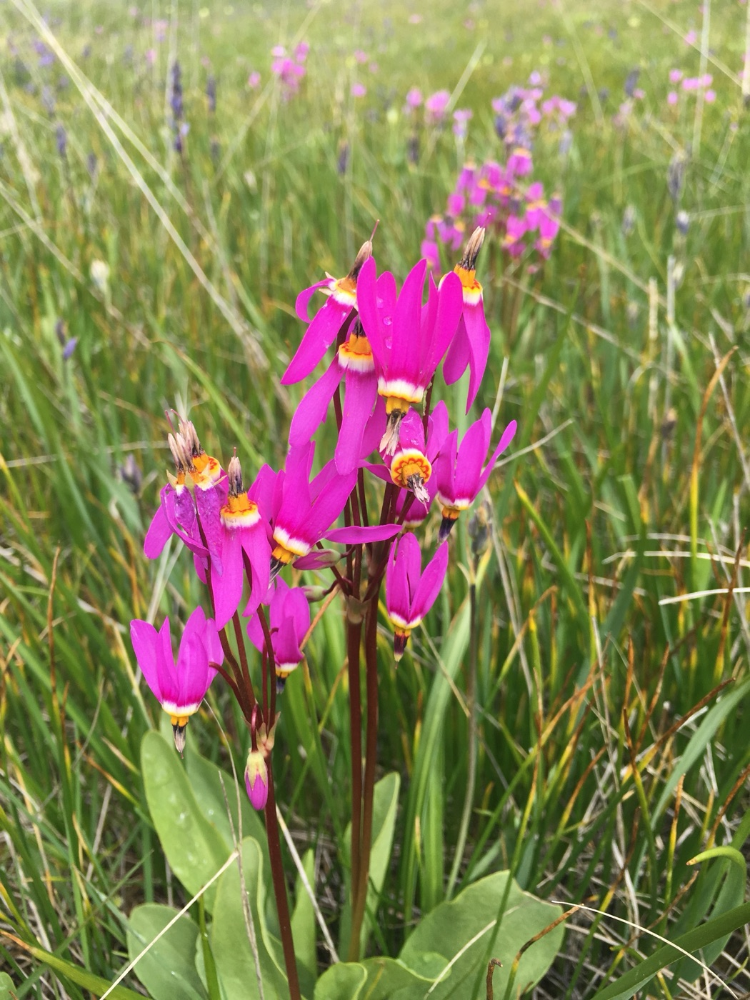
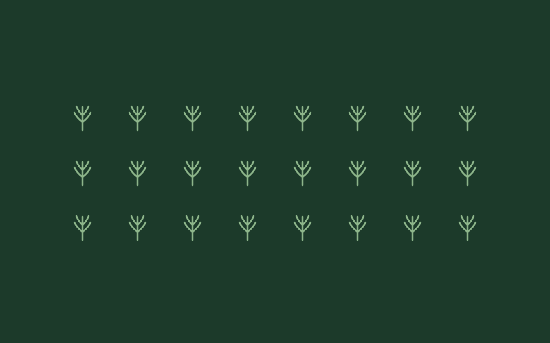
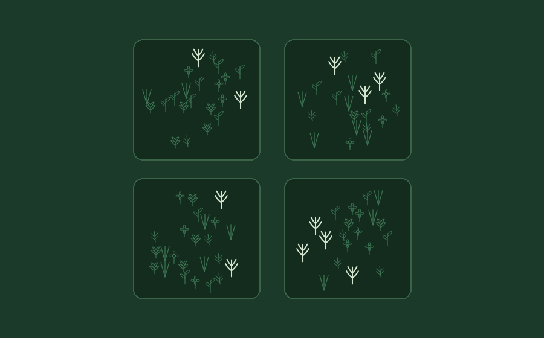

<em>Primula pauciflora</em>, one of two species we inferred as likely extirpated on Galiano Island. Photo: Peter Zika.

The Royal Botanic Gardens, Kew released its sixth [State of the World's Plants and Fungi report](https://www.kew.org/science/state-of-the-worlds-plants-and-fungi) this year, a conservation assessment drawing on work from over 400 scientists across 40 countries. So what is their assessment: How many of the world's plants and fungi are threatened with extinction, or have already disappeared? 

Fewer than a thousand plant species are documented as extinct—a figure almost certainly far below the true toll, given how many are rare, narrowly distributed, and barely recorded to begin with. Only a small fraction of known diversity has ever been formally assessed at all, and absence is almost always uncertain—an inference from negative evidence. In the SOTWPF report, [Aelys Humphreys and colleagues](https://doi.org/10.1111/nph.70552) propose a name for this gap: the *Katuš shortfall*—the unquantified dimensions of past, present, and future biodiversity loss.

To address this shortfall, the report points to probability-based approaches—commonplace in animal conservation, and newly feasible for some plants now that millions of herbarium specimens have been digitized—to estimate whether a species is truly gone or simply undetected. My colleagues and I take up the same challenge at the scale of an island, in a recent [paper](https://doi.org/10.1002/ppp3.70130) the report features as one of its case studies. Extinction, after all, happens one population at a time! But zooming in this far presents its own wicked problems: at the local scale, a species' entire recorded history can come down to a small number of records—even a singleton occurrence—too little for the data-hungry methods that work at broad scales.

Local populations can disappear gradually, without a singular record marking their loss.

The global biodiversity crisis is really a cascade of local extinction (extirpation) events—so it's locally that conservation must act to stop that crisis—and in practice it already does. The International Union for Conservation of Nature (IUCN) and the Committee on the Status of Endangered Wildlife in Canada (COSEWIC) assess species population by population, though where data are sparse those assessments lean on qualitative judgment or proxy measures. Our protocol, [documented here](https://imerss.github.io/detecting-local-extinction/docs/), addresses that gap, combining specimens, community science, and targeted surveys into a unified framework aligned with IUCN extinction criteria.

A species can be regionally common but locally rare and vulnerable to extirpation, making its gradual decline easy to overlook.

Herbarium specimens provide a critical baseline for this work, but they're not the whole record. Knowing whether a population is really gone also depends on local knowledge—e.g., memory of exactly where a species lives, held by those who live in the places biodiversity exists. That knowledge is itself endangered: with the continued decline of [local place-based knowledge and taxonomic expertise](https://doi.org/10.1016/j.tplants.2023.03.019), communities around the world face the vicious cycle of [cultural amnesia and shifting baselines](https://doi.org/10.1002/fee.1794)—amounting to what some have described as ["extinction of experience"](https://doi.org/10.1002/pan3.10118). In other words, [local human knowledge and memory of biodiversity are also vulnerable to extinction](https://doi.org/10.1016/j.tree.2021.12.011).

Harvey Janszen and Hannah Carpendale searching for <em>Platanthera unalascensis</em> on Stockade Hill, Galiano Island, British Columbia, in July 2020, less than a year before Harvey passed away.

That risk wasn't an abstract concern in our study. Amateur naturalist Harvey Janszen spent decades getting to know Galiano Island's flora, long before we thought to follow in his footsteps. Indeed, it was his memory of exactly where *Crassula connata* and *Primula pauciflora* had once grown that allowed us to define their historical habitat with enough precision to infer their extirpation with real confidence. Harvey passed away partway into our fieldwork, on May 10, 2021—and much of the knowledge necessary to conduct our study very nearly passed away with him.

Local awareness is vital to conserve vulnerable local populations before they're lost.

