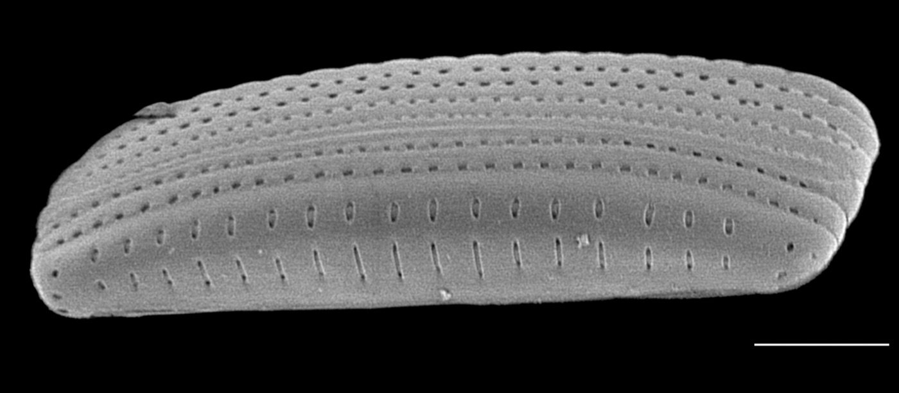
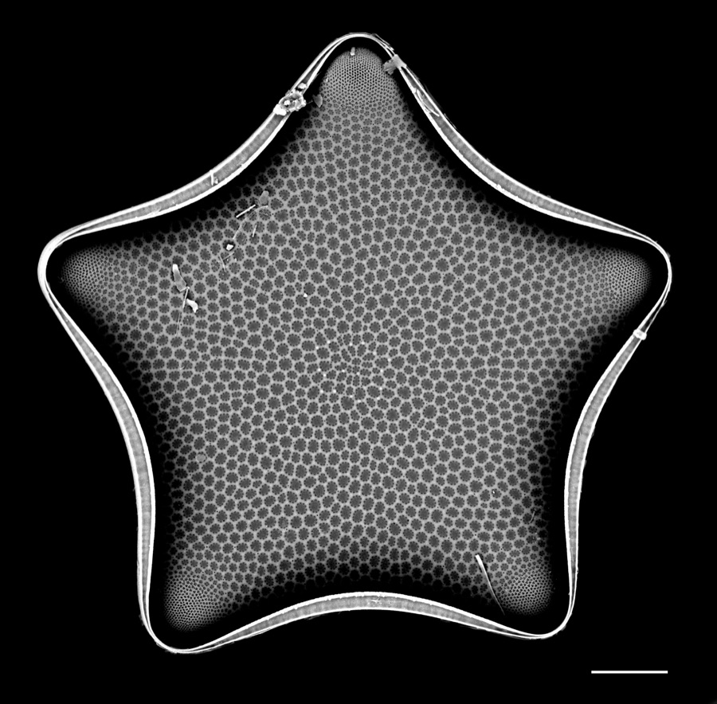

<em>Andrzeja fenestrata</em>, a recently described diatom species newly detected in the Salish Sea. Credit: Mark Webber, Dr. Elaine Humphrey (CC-BY 4.0).

For the first time, we've assembled a comprehensive baseline of diatom diversity in the Salish Sea — [a checklist](https://bdj.pensoft.net/article/189060/) covering 924 taxa, published in *Biodiversity Data Journal* with Mark Webber, Elaine Humphrey, Arjan van Asselt, Alice Chang, and Evan Morian.

Diatoms are easy to overlook — a major group of photosynthetic microalgae, invisible without a microscope — but they form the base of marine food webs that have sustained Coast Salish peoples for millennia, and their sensitivity to environmental change makes them one of the more useful indicators we have of ecosystem health. The Salish Sea has long been studied for its rich marine biodiversity, yet the history of research on its primary producers has been fragmented across scattered records; this is the first attempt to draw them into one consolidated baseline.

<em>Trigonium quinquelobatum</em>, one of the new regional reports among the 924 taxa. Credit: Mark Webber, Dr. Elaine Humphrey (CC-BY 4.0).

Sampling was concentrated around Galiano Island, drawing on the same community science infrastructure behind the [Biodiversity Galiano project](http://biogaliano.org) — literature records, microscope analysis, and molecular sequencing combined to build a fuller picture than any one method could on its own. The Salish Sea is home to roughly nine million people and is undergoing rapid growth in population, urbanization, and marine shipping, all of it bearing down on a bioregion most of us will never see the primary producers of. A baseline like this doesn't resolve that pressure, but it gives researchers and policymakers a reference point for noticing what changes.

The dataset is still being refined, and this is very much a foundation rather than a final word — but a foundation is what the region has been missing.
