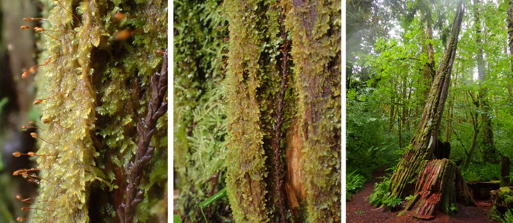

In May 2025, I found sporophytes of *Brotherella roellii* — Roell's Brotherella Moss — growing on an old-growth Western redcedar snag in Squamish, BC.

*Brotherella roellii* is endangered in Canada and, as far as anyone knows, found nowhere else on Earth. It was once also known from the United States, but is now believed extirpated from its historical American range, leaving a scatter of populations across Howe Sound, the Lower Mainland, and the Fraser Valley as its entire remaining stronghold.

This particular population, at the Cheakamus Centre, was first recorded in 1916 and last seen in 2006. Confirming it was still there — healthy, and possibly one of the most robust known populations in the Howe Sound region — felt less like a new discovery than like closing an eighty-year loop. The species appears to be gone from at least one of its historical sites elsewhere in Squamish, which makes protected, undisturbed refuges like the Cheakamus Centre increasingly important as development fragments the shaded, moist habitat it depends on.

iNaturalist featured the observation as an [Observation of the Day](https://www.inaturalist.org/observations/282952652), describing it as "a species found only in British Columbia & listed as endangered in Canada." It also became one of the data points behind a larger piece of news: the Squamish River watershed's recognition as a [Key Biodiversity Area of global significance](https://wcscanada.org/newsroom/news/squamish-river-recognized-as-a-key-biodiversity-area-of-global-importance/), owed in part to holding roughly 10% of this species' entire known population.

My current research looks at the abiotic conditions — light, moisture, substrate — that seem to limit where this moss can persist, work I hope will eventually feed into educational programming at the Cheakamus Centre itself.
