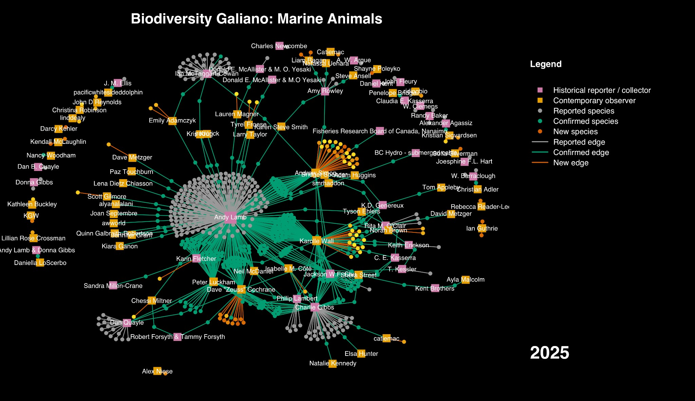

Pink squares are historical reporters, orange squares are contemporary observers. Grey dots are historical records still unconfirmed; green dots are confirmed; orange dots are new to the island. Every line is a person connected to a species.

Ten years ago I started keeping species lists for Galiano Island, without much sense of what that would turn into. This year, building a retrospective talk for Nature Vancouver, I turned the marine records into a network diagram, and it said something I hadn't fully seen from inside the project: biodiversity knowledge isn't really a list of species. It's a graph. Squares are people, dots are species, and a line between them is a single act of someone looking closely enough to write something down.

One thing this graph doesn't hold: everything here comes from one particular tradition of documenting species—specimens, lists, structured records—not from the much older, ongoing knowledge that Hul'qumi'num and SENĆOŦEN-speaking peoples hold about this place, which isn't mine to draw into a diagram. Most of what's mapped here existed on this coastline long before anyone wrote its name down.

The oldest node in the diagram traces to a species collected in 1859 by Alexander Agassiz—the striped green sea anemone, an introduced species, fittingly enough. We only know about the record because Rick Harbo tracked the citation down in a 1921 paper, decades after the fact—and, by coincidence, someone independently photographed the same species on Galiano and posted it to iNaturalist more than a century after Agassiz collected it. Two people, a century and a half apart, noticing the same small thing. That's the graph, in miniature.

Look at where the diagram gets dense, and one name accounts for a disproportionate share of it. Andy Lamb's Pacific Marine Life Surveys, running since 1968, logged over 16,000 records and turn out to be behind [60% of all novel marine species reports for the island](https://doi.org/10.3897/BDJ.10.e76050)—a small, informal diving survey outperforming most formal alternatives. On the diagram, Lamb isn't just a prolific contributor. He's structurally load-bearing: remove him and most of what we know about the island's marine fauna over the last fifty years collapses with him.

Ten years in, the numbers behind this graph: 686 marine species known for the island, 604 of them from the historical baseline and 82 added new since 2015. Community members have personally confirmed exactly half of the historical total—meaning the other half exists only as an old record, waiting for someone to go look again.

This is Part I of three, built from that Nature Vancouver talk, each centred on one of the network diagrams I drew from ten years of Biodiversity Galiano:

- [Part II: terrestrial arthropods](/research/structure-of-biodiversity-knowledge-terrestrial-arthropods/) — a professor's cabin full of specimens, and a chef's Instagram moths
- [Part III: vascular plants](/research/structure-of-biodiversity-knowledge-plants/) — the graph that carries this into a later paper about local extinction
