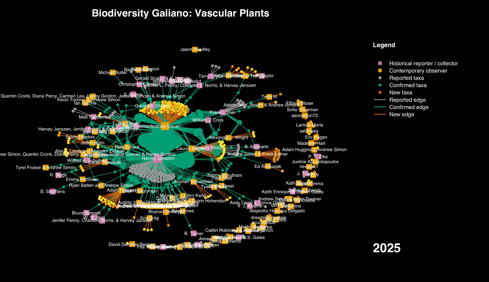

Harvey Janszen's decades of fieldwork form the densest historical cluster in the plant diagram—the same body of knowledge behind two extirpation calls in a <a href="/research/detecting-extinction-global-to-local/">later paper</a>.

The last of three network diagrams I built from ten years of Biodiversity Galiano records, for a retrospective talk to Nature Vancouver this year, covers vascular plants—and it's the one with the clearest line running out the other side, into work I'm still doing. The same idea holds across all three: biodiversity knowledge isn't a list of species, it's a graph of who was paying attention, and when. Squares are people, dots are species, and a line between them is one person looking closely enough to write something down.

One thing this graph doesn't hold: everything here comes from one particular tradition of documenting species—specimens, lists, structured records—not from the much older, ongoing knowledge that Hul'qumi'num and SENĆOŦEN-speaking peoples hold about this place, which isn't mine to draw into a diagram. Most of what's mapped here existed on this island long before anyone wrote its name down.

The densest historical cluster in this graph belongs to Harvey Janszen, whose decades of fieldwork on Galiano I've written about [elsewhere](/research/detecting-extinction-global-to-local/)—the same body of knowledge that let a later paper call two local plant extirpations with real confidence. Gerald Straley, a UBC botanist, forms the diagram's other major historical hub.

Records in this graph aren't just added, they're sometimes corrected—and that correction is its own kind of connection. In 2012, naturalist Terry Taylor identified Galiano's stinging nettles as the native *Urtica gracilis*, when most people—reasonably, going on the general assumption that nettles are usually introduced—had it down as *U. dioica*. It took the wider botanical community about a decade to come around to his correction. The plant hadn't changed. What we knew about it did.

Ten years in: over 800 vascular plant species known for the island, 87% of them documented by the project. That leaves roughly a hundred species—about 64 of them native—still unaccounted for since their historical record.

This is Part III of three, and the last. It follows [Part I: marine animals](/research/structure-of-biodiversity-knowledge-marine/) and [Part II: terrestrial arthropods](/research/structure-of-biodiversity-knowledge-terrestrial-arthropods/), and ends here, with the same kind of attention that, a few years later, let us say with real confidence that two of these plants were gone.
