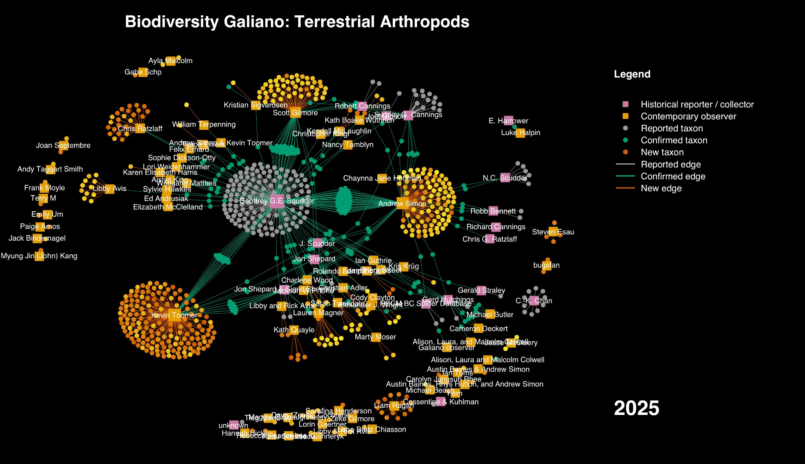

Scudder's decades of collecting form the historical core; recent contributors like Kevin Toomer and Chris Ratzlaff have built comparably dense clusters of their own.

Of the three network diagrams I built from ten years of Biodiversity Galiano records, for a retrospective talk to Nature Vancouver this year, the terrestrial arthropod graph makes the case most bluntly: biodiversity knowledge isn't a list of species, it's a record of who was paying attention, and when. Squares are people, dots are species, and a line between them is one person looking closely enough to write something down.

One thing this graph doesn't hold: everything here comes from one particular tradition of documenting species—specimens, lists, structured records—not from the much older, ongoing knowledge that Hul'qumi'num and SENĆOŦEN-speaking peoples hold about this place, which isn't mine to draw into a diagram. Most of what's mapped here existed on this island long before anyone wrote its name down.

The densest historical cluster belongs to Geoffrey Scudder, a UBC entomologist who kept a cabin on Galiano and collected insects there for decades, eventually handing over a hand-curated species list before he passed away. Recent contributors—Kevin Toomer and Chris Ratzlaff among them—have since built comparably dense clusters of their own, layering a second generation of structure onto Scudder's.

Not every observation makes it into the graph right away, either. Jesse McCleery, the chef at Pilgrimme on Galiano, had been photographing moths for years on his personal Instagram account, where none of it was doing any taxonomic work. It took a few years of asking before he moved those photos to iNaturalist, at which point several turned out to be new island records, including a moth found nowhere else in western North America but Galiano among the places we know to look. The knowledge existed the whole time. It just wasn't structurally connected to anything yet.

Ten years in: 1,520 terrestrial arthropod species known for the island, 75.7% of them observed by a project contributor. That leaves 369 taxa known only from old records—species we're confident once lived here, and haven't yet confirmed still do.

This is Part II of three, following on from [Part I: marine animals](/research/structure-of-biodiversity-knowledge-marine/). Next: [Part III: vascular plants](/research/structure-of-biodiversity-knowledge-plants/), which carries this into a later paper about local extinction.
